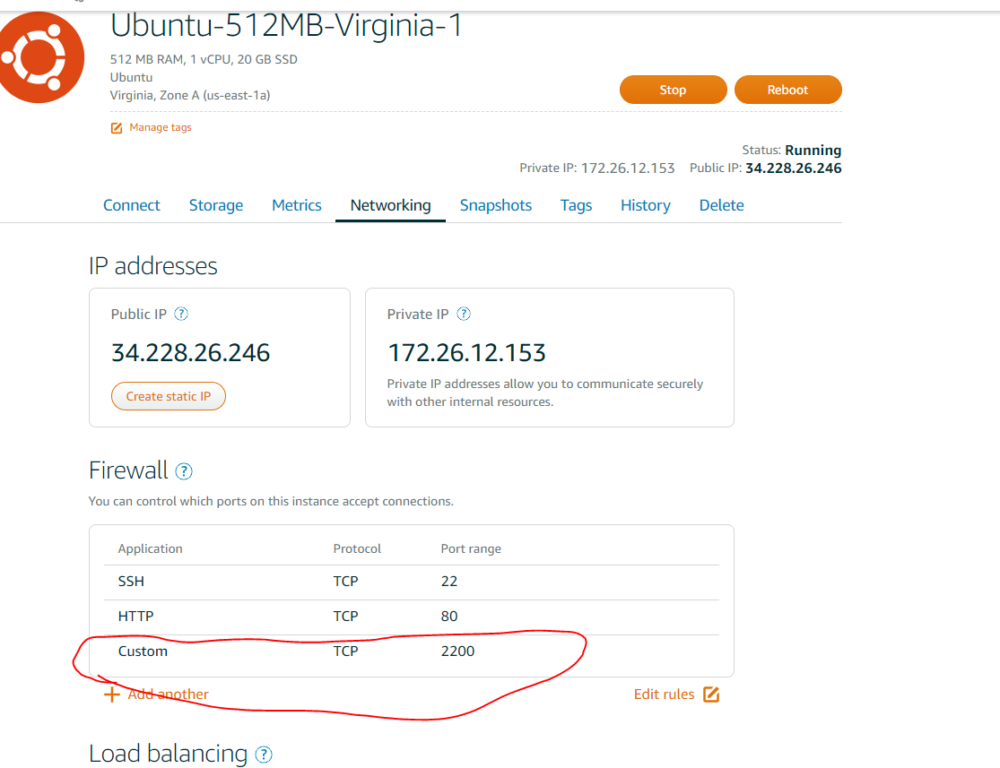
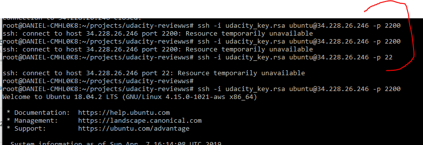

# Blocked SSH port after configuration on AWS Lightsail

### Issue description

The server cannot be reached through the selected SSH port after changing it on the `sshd_config` file and enabled on `UFW` settings 

### Basic task step by step

#### Install Apache engine
1. Update all currently installed packages
	```$bash
	sudo apt-get update
	sudo apt-get upgrade
	```
	

2. Change the SSH port from 22 to 2200
	* Use `sudo nano /etc/ssh/sshd_config` and then change Port 22 to Port 2200 , save & quit.
	* Reload SSH using `sudo service ssh restart`

3. Configure the Uncomplicated Firewall (UFW)

	* Configure the Uncomplicated Firewall (UFW) to only allow incoming connections for SSH (port 2200), HTTP (port 80), and NTP (port 123)
	```$bash
	sudo ufw allow 2200/tcp
	sudo ufw allow 80/tcp
	sudo ufw allow 123/udp
	sudo ufw enable 
	```


### Extra step to enable on AWS panel
> :warning: If you still cannot access the instance after making the changes run the following steps

1. Open the AWS panel on https://lightsail.aws.amazon.com/

2. Click on the instance details, it will redirect you to something like: `https://lightsail.aws.amazon.com/ls/webapp/us-east-1/instances/Ubuntu-512MB-Virginia-1/`

3. Now select the `Network` tab

4. Click on the `Add another` button on the bottom left

5. Select `Custom` on application column, `TCP`, and `2200` on the following

6. Reboot the machine
### Folders and file infos #### AWS panel configuration 


#### Instance SSH connections working



### Related issues
If you block the SSH port on UFW **BEFORE** changing the `sshd_config` file, you can create a deadlock, which is pretty much irreversible, check some links below to get general help on how to save time recreating the instance
* https://stackoverflow.com/questions/41929267/locked-myself-out-of-ssh-with-ufw-in-ec2-aws <- This one shows how to perform a recovery on AWS instances, so you would not lose all of your work

