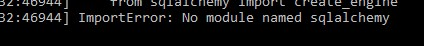

# Missing python modules

### Issue description

Python modules cannot be found, usually a `ImportError no module named X`

#### Debug Case 01 (missing global packages)

* Start python in REPL mode (just type in `python` in the command line to enter python terminal)

* Try importing the module there. `import flask` for example.

* If you get the same `ImportError` the module is not installed, therefore your application cannot use it

#### Solution Case 01

* Install the missing modules with sudo and pip. `sudo pip install flask` for example.

---

#### Debug Case 02 (missing virtualenv packages)

* Go to your project folder. (usually `/var/www/somename/somename`)

* Activate the virtualenv there. (usually `source ./venv/bin/activate`)

* Make sure there is a `(venv)` string at the start of the line

#### Solution Case 02

* Install the missing modules with virtualenv activated and pip. `pip install flask` for example.

---

#### Debug Case 03 (venv packages lacking of permission)

* If you are doing the REPL test mentioned above, the package is being importd but the application still cannot read them, so you may need to check permissions

* Make sure you have that your `.conf` (usually `/etc/apache2/sites-available/something.conf`) has the `WSGIDaemonProcess` property properly configured and pointing to your virtualenv

* Make sure the virtualenv folder has the correct ownership (`grader:grader`). You can use the `chown` command to change this if needed

* Make sure the virtualenv folder has the correct read/write permissions (`drwxr-xr-x`). You can use the `chmod` command to change this if needed

#### Case 03 documentation/references

* [Official mod_wsgi documentation](https://modwsgi.readthedocs.io/en/develop/user-guides/virtual-environments.html)

* [Stackoverflow thread](https://stackoverflow.com/questions/42661771/how-to-get-mod-wsgi-to-pick-up-my-virtualenv)

* [Github thread](https://github.com/twoscoops/django-twoscoops-project/issues/60)
